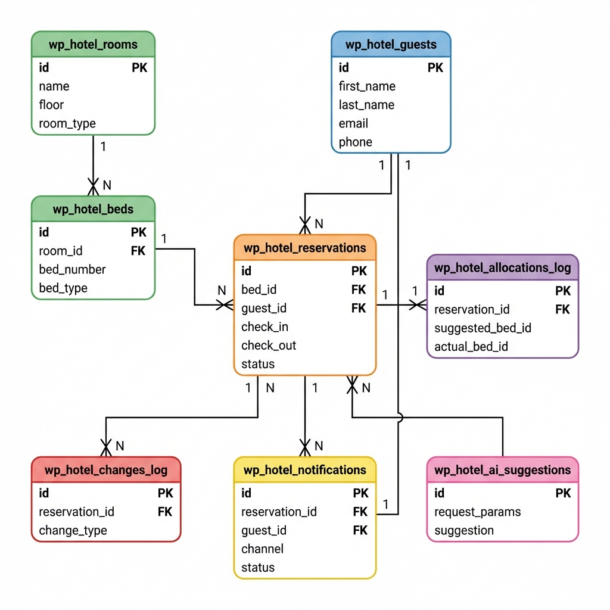

# Database Schema

## Entity Relationship Diagram (ERD)



## Tables Overview

1. `wp_hotel_rooms` - Room information
2. `wp_hotel_beds` - Beds in rooms
3. `wp_hotel_guests` - Guest contact data
4. `wp_hotel_reservations` - Reservations (per bed)
5. `wp_hotel_allocations_log` - AI allocation history
6. `wp_hotel_notifications` - Notification history
7. `wp_hotel_changes_log` - Change tracking
8. `wp_hotel_ai_suggestions` - AI suggestions log

## Relationships

```
rooms (1) ──→ (N) beds
beds (1) ──→ (N) reservations
guests (1) ──→ (N) reservations
reservations (1) ──→ (1) allocations_log
reservations (1) ──→ (N) changes_log
reservations (1) ──→ (N) notifications
guests (1) ──→ (N) notifications
```

## Detailed Schemas

See `core/database/class-schema.php` for SQL definitions.

## Migrations

Migrations are located in `core/database/migrations/` and run in numerical order:
1. `001-create-rooms.php`
2. `002-create-beds.php`
3. `003-create-guests.php`
4. `004-create-reservations.php`
5. `005-create-allocations-log.php`
6. `006-create-notifications.php`
7. `007-create-changes-log.php`
8. `008-create-ai-suggestions.php`
